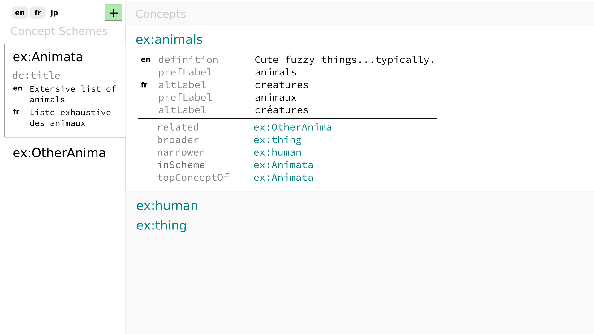
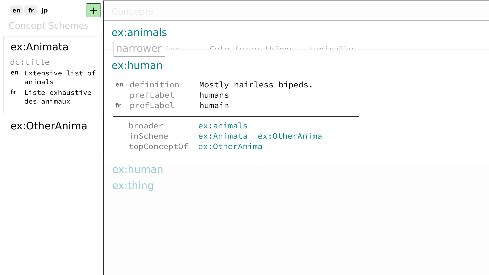

# A SKOS browser and editor

Early stage [SKOS](https://www.w3.org/TR/skos-primer/) browser and editor.

Built with [Vue.js](https://vuejs.org/), [LevelGraph](https://levelgraph.io/),
and [Semantic-UI](https://semantic-ui.com/).

## Usage

```sh
$ npm i
$ npm run dev
```

The `dev` script will build, watch, and serve Askos making it available at
`http://localhost:8888/`.

## Design Drafts

Early drafts of the overall intent of the design...highly subject to change.




See also the [design.svg](design.svg) file--which you're welcome to contribute
to!

## License

MIT
